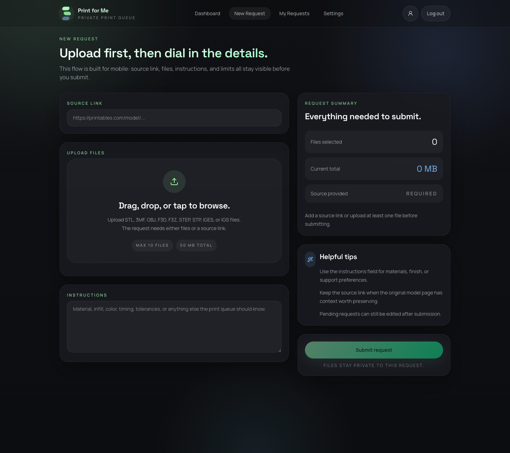
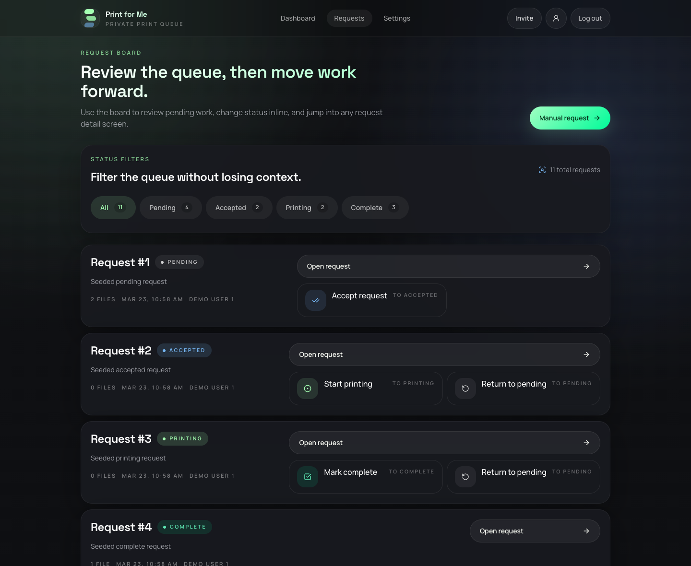

# Print for Me

Print for Me is a private 3D print request workflow built with Laravel 13, Inertia v2, Vue 3, and Tailwind CSS v4. It is designed for invite-only access, magic-link authentication, private file uploads, and a lightweight request board that works well on desktop and mobile.

This project was vibe coded with GPT 5.4 and designed with Google Stitch.

## Current State

The application currently supports:

- Invite-only onboarding with passwordless magic-link sign-in
- User request submission with private file uploads or source links
- A mobile-first request form with file-count and total-size guidance
- Admin request board with inline status transitions
- Request lifecycle tracking across `pending`, `accepted`, `printing`, and `complete`
- Secure file downloads, policy-based authorization, and queued notifications
- Session expiry and multi-device invalidation controls
- Retention commands for old completed files, soft-deleted requests, and stale magic links

## Screenshots

### New request flow



### Admin request board



## Stack

- PHP 8.4
- Laravel 13
- Inertia.js v2
- Vue 3
- Tailwind CSS v4
- SQLite by default for local development and tests
- Pest for backend testing
- Vite for frontend bundling

## Quick Start

1. Install dependencies:

   ```bash
   composer install
   npm install
   ```

2. Create your environment file:

   ```bash
   cp .env.example .env
   ```

3. Bootstrap the app:

   ```bash
   composer run setup
   ```

4. Start local development services:

   ```bash
   composer run dev
   ```

If you use Laravel Herd, the app is available at `https://print-for-me.test`.

## Environment Notes

`.env.example` now includes the application settings needed to boot the project cleanly:

- `APP_NAME`, `APP_URL`, and `APP_KEY`
- `DB_CONNECTION=sqlite`
- `QUEUE_CONNECTION=database`
- `FILESYSTEM_DISK=local`
- `MAIL_MAILER=log`
- `ADMIN_EMAIL=admin@example.com`

Optional mail subject customization is available through `MAIL_SUBJECT_PREFIX`.

## Demo Data

The default seeder creates:

- `admin@example.com` as the seeded admin account
- `demo1@example.com` and `demo2@example.com` as demo users
- Sample print requests across the full lifecycle

Authentication is magic-link only. To generate a fresh login link locally:

```bash
php artisan auth:invite admin@example.com
php artisan auth:invite demo1@example.com
```

## Common Commands

Run the main quality checks:

```bash
php artisan test --compact
npm run type-check
npm run lint
npm run build
vendor/bin/pint --dirty --format agent
```

Useful maintenance commands:

```bash
php artisan prints:purge-completed-files
php artisan prints:purge-soft-deleted
php artisan prints:warn-soft-deleted
php artisan auth:cleanup-magic-tokens
php artisan auth:purge-stale-magic-tokens
```

## Queueing And Mail

Local development defaults to the database queue driver and log mailer, so queued notifications work without Redis or SMTP setup. If you want to use Horizon, switch the queue connection to Redis and run Horizon separately.

## License

[MIT](LICENSE)
